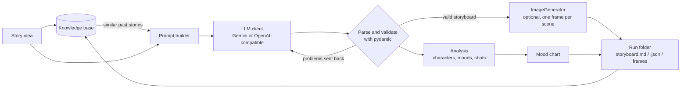
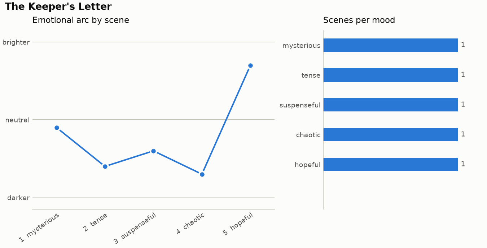

# AI Storyboard Weaver

[](https://github.com/1AyaNabil1/Ai-storyboard-Weaver/actions/workflows/test.yml)

AI Storyboard Weaver turns a few sentences of story into a shot-by-shot film
storyboard. Each scene gets a title, a camera-ready description, the characters
on screen, a mood, a shot type and its dialogue. You can also ask for one
illustrated frame per scene. Every run writes a readable `storyboard.md`, a
machine-readable `storyboard.json`, and a chart of how the mood moves through
the story.

It runs from the command line and works with Google Gemini or any server that
speaks the OpenAI REST API (OpenAI, OpenRouter, Ollama, vLLM, LM Studio and
others).

```console
$ storyboard-weaver generate "A detective discovers aliens in 1920s Chicago" --scenes 5 --style noir
```

## How it works



1. **Retrieve.** The story is compared with earlier runs stored in a local
   knowledge base. The closest matches (by cosine similarity of hashed
   bag-of-words vectors) are offered to the model as tone references.
2. **Write.** The model is asked for one JSON object in a fixed schema, with
   the allowed moods and shot types spelled out and the chosen style preset
   (cinematic, documentary, anime, noir or experimental) as direction.
3. **Validate and repair.** The reply is parsed even if it arrives wrapped in a
   Markdown fence or after a sentence of chatter, then validated by pydantic
   models. Common spellings are normalised (`"CU"`, `"close_up"` and
   `"Close up"` all mean a close-up). If the reply still does not fit, the
   specific problems (for example `scenes.2.mood: Input should be ...`) are
   sent back for a corrected answer, up to a configurable number of attempts.
4. **Illustrate (optional).** Each scene becomes an image prompt built from the
   style's look, the shot type, the description and the cast. Image providers
   sit behind a small `ImageGenerator` protocol, so the pipeline does not care
   which one is used. A refused frame is recorded and the run continues.
5. **Analyse and save.** The storyboard is indexed (which characters appear in
   which scenes and how many lines they speak; mood and shot counts), each
   mood is placed on a rough brighter/darker scale to draw the emotional arc,
   and everything is written to a new folder under `outputs/`.

Provider and model failures do not end in a traceback: transient HTTP errors
(timeouts, 429, 5xx) are retried with backoff, and anything else stops the run
with a one-line explanation and a non-zero exit code.

### Code map

| Module | Responsibility |
| --- | --- |
| `models.py` | Pydantic schema: `Storyboard`, `Scene`, `DialogueLine`, `Mood`, `ShotType` |
| `parsing.py` | Pull JSON out of model replies and report schema errors by path |
| `prompts.py` | Storyboard, repair and image prompts |
| `llm.py` | `LLMClient` protocol, Gemini and OpenAI-compatible clients |
| `images.py` | `ImageGenerator` protocol, OpenAI and Gemini image backends |
| `transport.py` | Shared HTTP POST with retries and key-safe error messages |
| `knowledge.py` | JSON knowledge base and similarity search |
| `analysis.py`, `viz.py` | Story statistics and the mood chart |
| `pipeline.py` | `StoryboardWeaver`, which ties the steps together |
| `cli.py` | The `storyboard-weaver` command |

## Quick start

Requires Python 3.11 or newer.

```bash
git clone https://github.com/1AyaNabil1/Ai-storyboard-Weaver.git
cd Ai-storyboard-Weaver
python -m venv .venv
source .venv/bin/activate            # Windows: .venv\Scripts\activate
pip install -r requirements.txt
pip install --no-deps -e .

cp .env.example .env                 # then put your key in .env
```

A Gemini key from [Google AI Studio](https://aistudio.google.com/apikey) is
enough for text-only storyboards. Then:

```bash
storyboard-weaver generate "A lighthouse keeper finds a message in a bottle that predicts tomorrow's storm"
storyboard-weaver generate --file my_story.txt --scenes 6 --style documentary
echo "Two rival bakers fall in love during a village fair" | storyboard-weaver generate -n 3

# with frames (makes one image request per scene; check your provider's pricing)
storyboard-weaver generate "..." --images gemini

storyboard-weaver styles             # list the style presets
storyboard-weaver history            # list earlier storyboards
python -m storyboard_weaver --help   # same CLI without the entry point
```

Each run creates a folder named after the UTC time and the title, such as
`outputs/20261003-093000-the-keeper-s-letter/`:

```text
storyboard.md      the storyboard to read, with frames and the chart embedded
storyboard.json    story, settings, validated storyboard, analysis, frame paths and errors
mood_chart.png     emotional arc across scenes and the mood distribution
frames/            scene_01.png, scene_02.png, ... (only when images are enabled)
```

The mood chart looks like this. This one is drawn from the sample storyboard
used in the test suite, not from a model run:



### Using it from Python

```python
from pathlib import Path

from storyboard_weaver.config import Settings
from storyboard_weaver.images import build_image_generator
from storyboard_weaver.knowledge import KnowledgeBase
from storyboard_weaver.llm import build_llm
from storyboard_weaver.pipeline import StoryboardWeaver

settings = Settings.from_env()
weaver = StoryboardWeaver(
    build_llm(settings),
    image_generator=build_image_generator(settings),  # None when images are off
    knowledge_base=KnowledgeBase(settings.kb_path),
)
result = weaver.run(
    "A heist in a city-wide blackout", scenes=4, style="noir", output_dir=Path("outputs")
)
print(result.manifest.storyboard.title, result.markdown_path)
```

Any object with a `complete(prompt, *, system=None, json_output=False) -> str`
method can replace the LLM client, and any object with
`generate(prompt) -> GeneratedImage` can replace the image backend.

## Configuration

Settings come from environment variables. The CLI also reads a `.env` file in
the current directory (real environment variables take precedence). See
[`.env.example`](.env.example).

| Variable | Default | Meaning |
| --- | --- | --- |
| `STORYBOARD_LLM_PROVIDER` | `gemini` | `gemini` or `openai` (any OpenAI-compatible server) |
| `STORYBOARD_LLM_MODEL` | provider default | Text model name |
| `STORYBOARD_IMAGE_PROVIDER` | `none` | `none`, `gemini` or `openai` |
| `STORYBOARD_IMAGE_MODEL` | provider default | Image model name |
| `STORYBOARD_IMAGE_SIZE` | `1536x1024` | Frame size; Gemini uses the nearest supported aspect ratio |
| `GEMINI_API_KEY` | | Needed when either provider is `gemini` |
| `OPENAI_API_KEY` | | Needed when either provider is `openai`; any placeholder for local servers |
| `OPENAI_BASE_URL` | `https://api.openai.com/v1` | Point at OpenRouter, Ollama (`http://localhost:11434/v1`), vLLM, ... |
| `GEMINI_BASE_URL` | Gemini v1beta endpoint | Override for proxies |
| `STORYBOARD_OUTPUT_DIR` | `outputs` | Where run folders are written |
| `STORYBOARD_KB_PATH` | `<output dir>/knowledge_base.json` | Knowledge base file |
| `STORYBOARD_MAX_ATTEMPTS` | `3` | Model attempts before giving up on invalid output |
| `STORYBOARD_TIMEOUT` | `90` | Per-request timeout in seconds |

The provider defaults live in `src/storyboard_weaver/config.py`. Model names
change often, so set `STORYBOARD_LLM_MODEL` or `STORYBOARD_IMAGE_MODEL` if a
default has been retired.

Command-line flags (`--provider`, `--model`, `--images`, `--output-dir`,
`--no-memory`) override the environment for a single run.

## Tests and linting

The test suite is fully offline. The pipeline and CLI are tested with a
scripted fake LLM and a fake image generator; the HTTP clients are tested
against `httpx.MockTransport`, which checks the exact request each provider
receives and how each kind of response or error is handled.

```bash
pip install -r requirements-dev.txt
pip install --no-deps -e .
ruff check .
ruff format --check .
pytest
```

GitHub Actions runs the same commands on Python 3.11, 3.12 and 3.13
([workflow](.github/workflows/test.yml)).

## Limitations

- **No live API calls in the tests.** Request and response formats follow the
  providers' documentation and are checked against mocks; a provider changing
  its API could still break a real run.
- **Frames are generated independently.** Image models do not remember earlier
  frames, so a character can look different from one scene to the next.
- **The mood arc is a heuristic.** Moods come from the language model and are
  placed on a hand-written brighter/darker scale. The chart shows the story's
  shape as the model described it, not a measured sentiment.
- **Retrieval matches words, not meaning.** The default embedder is a hashed
  bag of words with light stemming. It finds stories that share vocabulary;
  swap in a sentence-embedding model through the `Embedder` protocol if you
  need semantic matches.
- **Output quality depends on the model.** Validation guarantees the structure
  of a storyboard, not that it is good filmmaking.
- **Image generation costs money with most providers** and may be refused by
  their safety filters; refused frames are listed in `storyboard.md`.

## Project history

The project began in April 2025 as my capstone for the Kaggle and Google Gen AI
Intensive Course (2025 Q1): a single notebook with a Gemini-backed storyboard agent,
embedding-based retrieval over past plots, and an ipywidgets interface. That
notebook is kept, unchanged apart from an indentation fix, in
[`notebooks/ai_storyboard_weaver.ipynb`](notebooks/ai_storyboard_weaver.ipynb).
The package in `src/` is a rewrite of the same idea as a tested,
provider-independent tool.

## License

[MIT](LICENSE) © 2025 Aya Nabil
